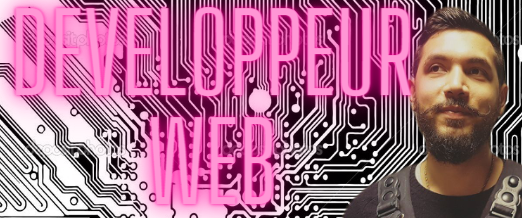

  

<h1 align="center"> 👋 Hi I'm Tony P. !</h1>

  

- 🌱  I'm a student in web development.

- 🔭 I’m currently learning **React**, **TypeScript**.

- 💬 If you want to know more about me [Linkedin](https://www.linkedin.com/in/tony-poomipartes/)

- 🖥️ My [portfolio](https://poomipartes.netlify.app)

- 📫 Or contact me: <tony.p.pro@gmail.com>

## Who am I?

Hello everyone, I'm a tech lover, very curious about the blockchain ecosystem and all programming Languages. 
I've been working on the construction site as a lead electrician but after spending two years in Australia and New Zeland I realized that I needed to work with what passionate me the most, that's why I've decided to start a new chapter of my life and turning myself into web development. 
I've started a training course at the O'Clock school to increase my self-knowledge of programming, we learned HTML, CSS, and Javascript with a Node.js environment, PostgreSQL, MongoDB, and GraphQL in data management, Git for the versioning and Bash to know how to navigate in the terminal. 
During my training, I've been working in a team to build from the ground up a project of a recipe site with an API rest, it was challenging and I enjoy working in a team as a Backend developer. 
I'm currently learning React Redux by myself and my next plan is to start a personal side project with TypeScript, Solidity, and HardHat to learn how to develop smart contracts, Dapps, and bridges into Web3. 
Feel free to leave me a message, I would be happy to answer you the best I can. 

Je suis un électricien curieux de nature , touche à tout et surtout branché Tech qui a décidé de changer de branche pour me mettre au développement web.
Avec 23 ans d'expérience dans l'électricité et deux ans en Australie et en Nouvelle-Zélande, je m'envole à nouveau pour de nouvelles opportunités professionnelles.
Après une formation de développement web avec une spécialisation backend à O'clock depuis septembre, j'ai hâte de mettre toutes mes compétences  au service d'une entreprise qui recherche un profil polyvalent.
Alors, si vous avez besoin de quelqu'un qui peut tout raccorder (et pas que des fils électriques), n'hésitez pas à me contacter !
<!--
**Tony-Poomipartes/Tony-Poomipartes** is a ✨ _special_ ✨ repository because its `README.md` (this file) appears on your GitHub profile.

Here are some ideas to get you started:

- 🔭 I’m currently working on Graphsql technology
- 🌱 I’m currently learning Javascript 
- 👯 I’m looking to collaborate on ...
- 🤔 I’m looking for help with ...
- 💬 Ask me about ...
- 📫 How to reach me: ...
- 😄 Pronouns: ...
- ⚡ Fun fact: ...
-->
---

## Connect with me

 

## Skills

|  |  |  |  |  |  |  |  |
|-|-|-|-|-|-|-|-|
|Visual Studio Code||      |Bash CLI||      |GIT||
|HTML||      |CSS||      |Sass|
|JavaScript||      |TypeScript||
|Node.js||      |Express||      |Sequelize||
|PostgreSQL||      |mongo db||      |graphql||
|astro||      |vite||      |Next.js||

 

## Stats

 

   

